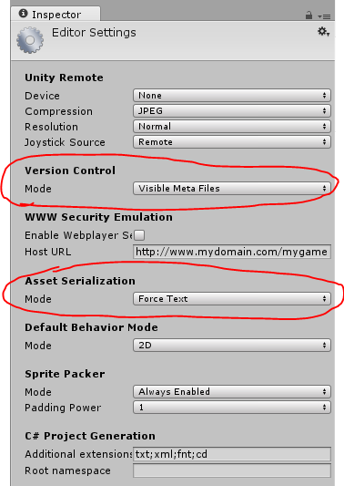

# Unity Smart Merge Tool

Unity 5 comes with a built-in tool that handles prefab and scene merge conflicts. The documentation on how to set it up is scarce and confusing (specially for first time git users).
This is a guide on how to set up the tool with Git.

_Note: you can use this with any Git client, as far as I know (ex: GitHub for Windows)._

## Unity Smart Merge set up

1. Download a fallback merge tool of your prefference (some fallback tools are listed in the mergespecfile.txt, mentioned bellow). <br/>
_The fallback tool is only used for conflicts that need human input and cannot otherwise be resolved, so you can always just resolve conflicts in the old fashioned way, if ever need be, by using the code editor of your choice! No need to install anything else!_

2. Go to the Unity installation folder in **Editor/Data/Tools and find the mergespecfile.txt** file, the path may vary according to your OS, on Windows it's normally in `C:\Program Files\Unity\Editor\Data\Tools\mergespecfile.txt` or `C:\Program Files (x86)\Unity\Editor\Data\Tools\mergespecfile.txt`. <br/>
In OSX you can find it in `/Applications/Unity/Unity.app/Contents/Tools/`

3. This file tells you how to set up the merge tool for various third party applications. You can notice how the only uncommented lines are **`unity use etcetcetc`** and **`prefab use etcetcetc`**, these lines indicate the calls to the fallback tool to solve scene (_unity use_) and prefab (_prefab use_) conflicts when the tool can't. If we had Perforce installed, for example, all we had to do is **replace these 2 lines with:** <br/>
**`unity use "C:\Program Files\Perforce\p4merge.exe" "$BASE" "$LOCAL" "$REMOTE" "$MERGED"`**<br/>
**`prefab use "C:\Program Files\Perforce\p4merge.exe" "$BASE" "$LOCAL" "$REMOTE" "$MERGED"`**<br/>
After that, save and close.</br>
_If you choose to not use any of those tools, leave it empty, insert your editor's url and/or search how to integrate it with a mergetool. Leaving it empty also works._

## Git set up

**_Note: these next steps need to be done whenever you make a new Unity project._**

1. Go to the project folder and make sure you can see the hidden files and folders, go to the **.git folder** and open the **config** file with a text editor of your choice.

2. **Add the following lines** to the file and save it:
```
[merge]
 tool = unityyamlmerge
[mergetool "unityyamlmerge"]
 trustExitCode = false
 cmd = 'C:\\Program Files\\Unity\\Editor\\Data\\Tools\\UnityYAMLMerge.exe' merge -p "$BASE" "$REMOTE" "$LOCAL" "$MERGED"
```

## Unity project set up

**_Note: these next steps need to be done whenever you make a new Unity project._**

1. Open the project in Unity, go to the top bar and select Edit and go to **Project Settings>Editor**;

2. Change the **Version Control mode to Visible Meta Files** and the **Asset Serialization mode to Force Text**, like shown in the picture. <br/>


## How to use

Whenever you're merging or rebasing your project and a conflict appears, instead of manually fixing it you open **Git Shell/Bash** and type the following command: **`git mergetool`**.
The tool will then resolve those conflicts for you automatically. </br>
If there is a conflict that needs human input, the fallback tool (i.e: Preforce) will run and show the conflicts that need resolving (don't forget to save your changes and then close). If you don't have a fallback tool, you'll just get a message stating this, but you'll still be able to resolve the conflitcs in your editor.

**You will need then to run the command `git add --all` or `git add .` in order to save the changes made, and then `git rebase --continue` when rebasing or `git merge --continue` when merging.**


### Resources
[Unity Manual - Smart Merge](https://docs.unity3d.com/Manual/SmartMerge.html) <br/>
[Reddit - How to solve scene conflicts with Unity's Smart Merge (5.1 fixes)](https://www.reddit.com/r/Unity3D/comments/39bdq5/how_to_solve_scene_conflicts_with_unitys_smart/)<br/>
[How to use Git for Unity source control?](http://stackoverflow.com/questions/18225126/how-to-use-git-for-unity-source-control)

---

Feel free to contact me @[twitter](http://twitter.com/anacatte) if you have any questions or just wanna chat!
